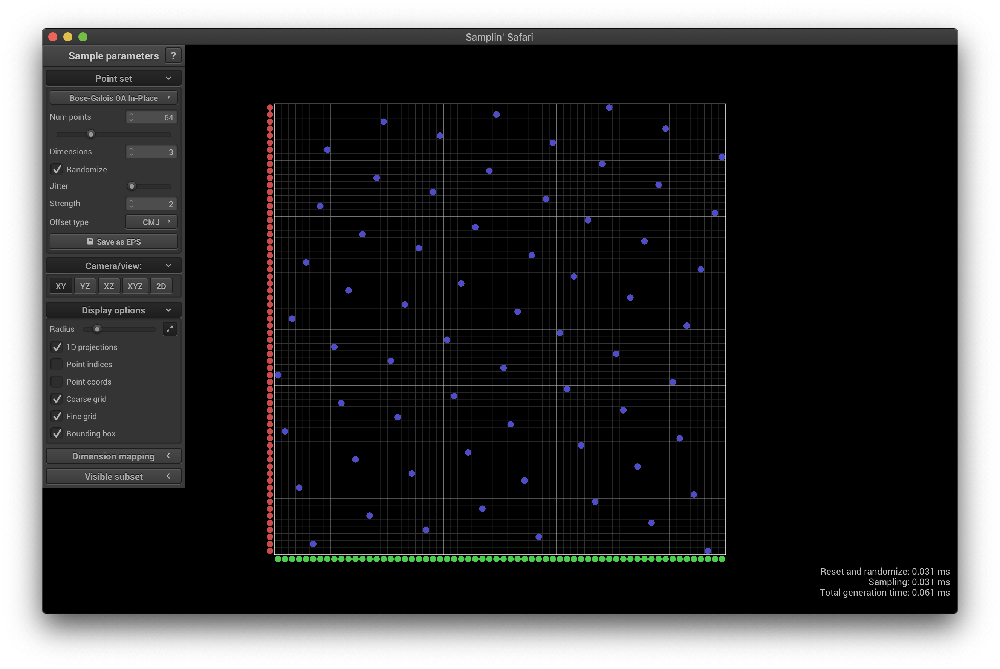
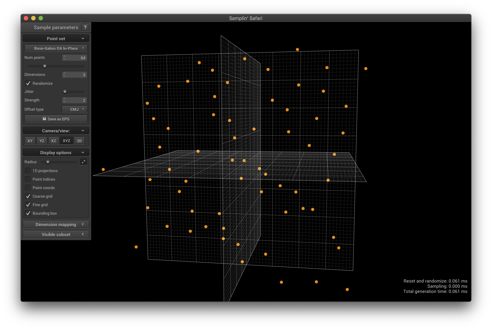
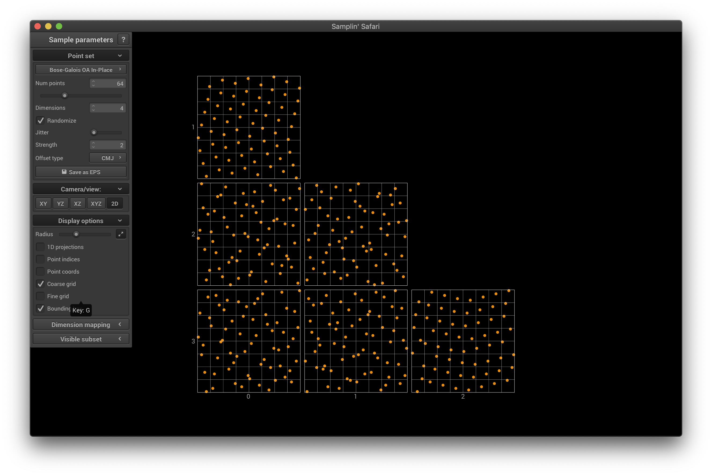

# Samplin' Safari

Samplin' Safari is a research tool to visualize and interactively inspect high-dimensional (quasi) Monte Carlo sampling techniques.

It was initially developed as part of the publication:

> **Orthogonal Array Sampling for Monte Carlo Rendering** 
> Wojciech Jarosz, Afnan Enayet, Andrew Kensler, Charlie Kilpatrick, Per Christensen 
> In *Computer Graphics Forum (Proceedings of EGSR), 38(4), July 2019* 
> [Project page](https://cs.dartmouth.edu/~wjarosz/publications/jarosz19orthogonal.html)
> [PDF](https://cs.dartmouth.edu/~wjarosz/publications/jarosz19orthogonal.pdf)

and now released under the 3-clause BSD license. For details, see the [LICENSE](LICENSE) file.

## Screenshots

  

## Features

### Supported samplers

* [Independent random](include/sampler/Random.h)
* [Regular grid and Jittered](include/sampler/Jittered.h)
* [(Correlated) Multi-jittered](include/sampler/MultiJittered.h)
* [Orthogonal Arrays](include/sampler/OA.h)
    * [Bose construction](include/sampler/OABose.h)
    * [Bush construction](include/sampler/OABush.h)
    * [Addelman-Kempthorne construction]((include/sampler/OAAddelmanKempthorne.h))
    * [Bose-Bush construction](include/sampler/OABoseBush.h)
* [N-Rooks (Latin hypercubes)](include/sampler/NRooks.h)
* [Sobol'](include/sampler/Sobol.h)
* [XORed/shuffled (0,2) sequence](include/sampler/Sobol.h#L40)
* [Halton (Zaremba)](include/sampler/Halton.h)
* [Hammersley (Zaremba)](include/sampler/Hammersley.h)
* [Larcher-Pillischammer (with Gruenschloss-Keller extension to 3D)](include/sampler/LP.h)

## Additional features
* interactively switching samplers, setting number of samples, dimensions, and various sampler parameters
* 3D and 2D orthographic views for X, Y and Z dimensions
* view of all 2D projections (useful for high-dimensional samples)
* custom mapping of any (higher) dimensions to X, Y or Z
* save all of these views as vector EPS files
* show point index and point coordinates
* show stratification grids
* displaying only a subset of points, either by subsetting on sample index, or sample coordinates.

## Compiling

Compiling requires CMake and a C++11 toolchain. Primary development in on macOS, but the code should also successfully compile on Linux and Windows.

### macOS and Linux

On macOS and Linux, compiling should be as simple as

    git clone --recursive https://github.com/wkjarosz/SamplingSarafi.git
    cd SamplinSafari
    mkdir build
    cd build
    cmake-gui ../
    make -j 4

## Acknowledgements

Samplin' Safari was primarily developed by Wojciech Jarosz with additions from Afnan Enayet.

The code depends on the following libraries (which are included as git submodules in the `ext` subdirectory):

* [NanoGUI](https://github.com/wjakob/nanogui), which is available under a BSD-style license.
* [galois++](https://github.com/wkjarosz/galois), which is available under a BSD-style license.
* [pcg32](https://github.com/wjakob/pcg32), which is available under the Apache License.
* [tinyformat](https://github.com/mitsuba-renderer/tinyformat), which is available under the Boost Software License.

Several of the orthogonal array constructions are adapted from [Art Owen's code in Statlib](http://ftp.uni-bayreuth.de/math/statlib/designs/).
